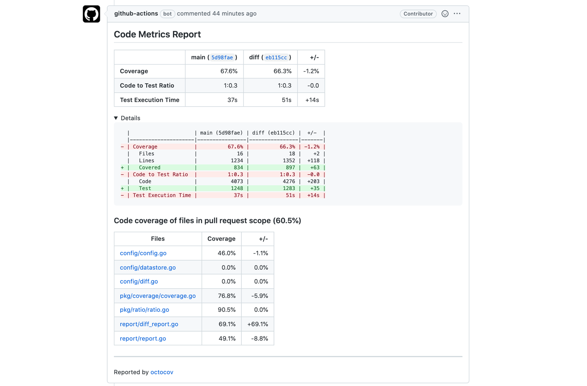
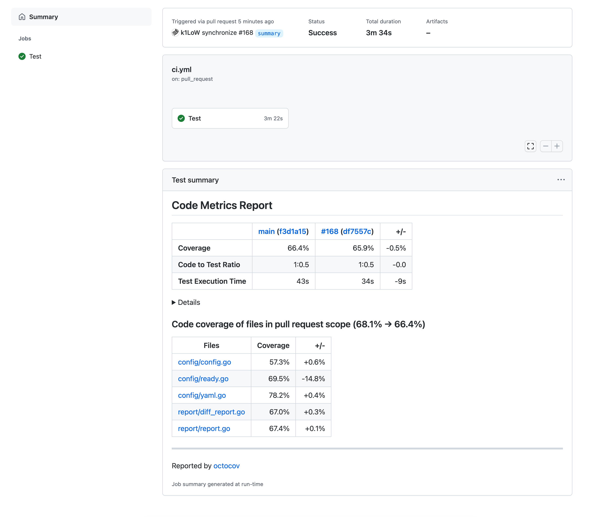
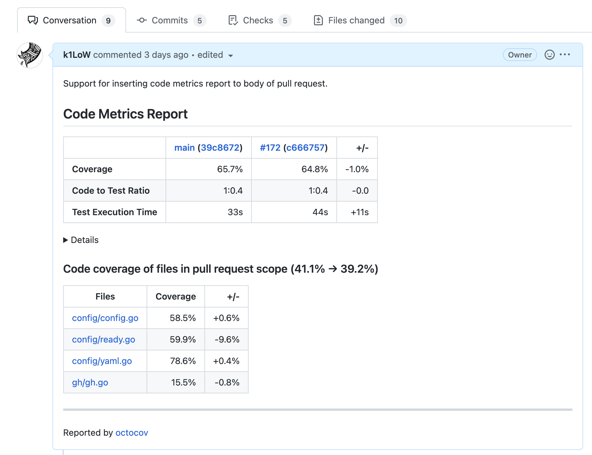
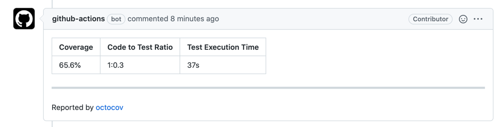

<p align="center">

</p>

   [](https://github.com/k1LoW/octocov/actions/workflows/ci.yml)

`octocov` is a toolkit for collecting code metrics (code coverage, code to test ratio and test execution time).

Key features of `octocov` are:

- **Useful both [as a CI tool](#on-github-actions) and [as a CLI tool](#on-terminal)**
- **[Support multiple coverage report formats](#supported-coverage-report-formats).**
- **[Support multiple code metrics](#supported-code-metrics).**
- **[Support for even generating coverage report badge](#generate-coverage-report-badge-self).**
- **[Have a mechanism to aggregate reports from multiple repositories](#store-report-to-central-datastore).**

## Getting Started

### On GitHub Actions

**:octocat: GitHub Actions for octocov is [here](https://github.com/k1LoW/octocov-action) !!**

First, run test with [coverage report output](#supported-coverage-report-formats).

For example, in case of Go language, add `-coverprofile=coverage.out` option as follows

``` console
$ go test ./... -coverprofile=coverage.out
```

And generete `.octocov.yml` to your repository.

``` console
$ octocov init
.octocov.yml is generated
```

And set up a workflow file as follows and run octocov on GitHub Actions.

``` yaml
# .github/workflows/ci.yml
name: Test

on:
  pull_request:

jobs:
  test:
    runs-on: ubuntu-latest
    steps:
      -
        uses: actions/checkout@v3
      -
        uses: actions/setup-go@v3
        with:
          go-version-file: go.mod
      -
        name: Run tests with coverage report output
        run: go test ./... -coverprofile=coverage.out
      -
        uses: k1LoW/octocov-action@v0
```

Then, octocov comment the report of the code metrics to the pull request.



It is also possible to add reports to [GitHub Actions Job Summaries](https://github.blog/2022-05-09-supercharging-github-actions-with-job-summaries/) by editing .octocov.yml.



It can also be inserted into the body of a pull request.



> **Note** that only pull requests from the same repository can be commented on (Reporting to GitHub Actions Job Summaries is permitted). This is because the workflow token of a forked pull request does not have write permission.

### On Terminal

octocov acts as a code metrics viewer on the terminal.

For example, in case of Go language, add `-coverprofile=coverage.out` option as follows

``` console
$ go test ./... -coverprofile=coverage.out
```

And run `octocov ls-files` , `octocov view [FILE...]` and `octocov diff [REPORT_A] [REPORT_B]`


## Usage example

### Comment report to pull request

By setting `comment:`, [comment the reports to pull request](https://github.com/k1LoW/octocov/pull/30#issuecomment-860188829).



``` yaml
# .octocov.yml
comment:
  hideFooterLink: false # hide octocov link
```

octocov checks for **"Code Coverage"** by default. If it is running on GitHub Actions, it will also measure **"Test Execution Time"**.

If you want to measure **"Code to Test Ratio"**, set `codeToTestRatio:`.

``` yaml
comment:
codeToTestRatio:
  code:
    - '**/*.go'
    - '!**/*_test.go'
  test:
    - '**/*_test.go'
```

By setting `report:` ( `report.path:`  or `report.datastores` ) and `diff:` ( `diff.path:`  or `diff.datastores` ) additionally, it is possible to show differences from previous reports as well.

``` yaml
comment:
report:
  datastores:
    - artifact://${GITHUB_REPOSITORY}
diff:
  datastores:
    - artifact://${GITHUB_REPOSITORY}
```


### Check for acceptable score

By setting `coverage.acceptable:`, the condition of acceptable coverage is specified.

If this condition is not met, the command will exit with exit status `1`.

``` yaml
# .octocov.yml
coverage:
  acceptable: 60%
```

``` console
$ octocov
Error: code coverage is 54.9%. the condition in the `coverage.acceptable:` section is not met (`60%`)
```

By setting `codeToTestRatio.acceptable:`, the condition of acceptable "Code to Test Ratio" is specified.

If this condition is not met, the command will exit with exit status `1`.

``` yaml
# .octocov.yml
codeToTestRatio:
  acceptable: 1:1.2
  code:
    - '**/*.go'
    - '!**/*_test.go'
  test:
    - '**/*_test.go'
```

``` console
$ octocov
Error: code to test ratio is 1:1.1, the condition in the `codeToTestRatio.acceptable:` section is not met (`1:1.2`)
```

By setting `testExecutionTime.acceptable:`, the condition of acceptable "Test Execution Time" is specified **(on GitHub Actions only)** .

If this condition is not met, the command will exit with exit status `1`.

``` yaml
# .octocov.yml
testExecutionTime:
  acceptable: 1 min
```

``` console
$ octocov
Error: test execution time is 1m15s, the condition in the `testExecutionTime.acceptable:` section is not met (`1 min`)
```

### Generate report badges self.

By setting `*.badge.path:`, generate badges self.

``` yaml
# .octocov.yml
coverage:
  badge:
    path: docs/coverage.svg
```

``` yaml
# .octocov.yml
codeToTestRatio:
  badge:
    path: docs/ratio.svg
```

``` yaml
# .octocov.yml
testExecutionTime:
  badge:
    path: docs/time.svg
```

You can display the coverage badge without external communication by setting a link to this badge image in README.md, etc.

``` markdown
# mytool

  
```

  

### Push report badges self.

By setting `push:`, git push report badges self.

``` yaml
# .octocov.yml
coverage:
  badge:
    path: docs/coverage.svg
push:
```

### Store report to datastores

By setting `report:`, store the reports to datastores and local path.

``` yaml
# .octocov.yml
report:
  datastores:
    - github://owner/coverages/reports
    - s3://bucket/reports
```

``` yaml
# .octocov.yml
report:
  path: path/to/report.json
```

#### Supported datastores

- GitHub repository
- GitHub Actions Artifacts
- Amazon S3
- Google Cloud Storage (GCS)
- BigQuery
- Local

### Central mode

By enabling `central:`, `octocov` acts as a central repository for collecting reports ( [example](example/central/README.md) ).

``` yaml
# .octocov.yml for central mode
central:
  root: .                                  # root directory or index file path of collected coverage reports pages. default: .
  reports:
    datastores:
      - bq://my-project/my-dataset/reports # datastore paths (URLs) where reports are stored. default: local://reports
  badges:
    datastores:
      - local://badges                     # directory where badges are generated.
  push:                                    # enable self git push
```

#### Supported datastores

- GitHub repository
- GitHub Actions Artifacts
- Amazon S3
- Google Cloud Storage (GCS)
- BigQuery
- Local

### View code coverage report of file

`octocov ls-files` command can be used to list files logged in code coverage report.

`octocov view` (alias: `octocov cat`) command can be used to view the file coverage report.


## Configuration

### `repository:`

The name of the repository.

It should be in the format `owner/repo`.

By default, the value of the environment variable `GITHUB_REPOSITORY` is set.

In case of monorepo, code metrics can be reported to datastore separately by specifying `owner/repo/project-a` or `owner/repo@project-a`.

``` yaml
repository: k1LoW/octocov
```

### `coverage:`

Configuration for code coverage.

### `coverage.path:`

`coverage.path:` has been deprecated. Please use `coverage.paths:` instead.

### `coverage.paths:`

The path to the coverage report file.

If no path is specified, the default path for each coverage format will be scanned.

``` yaml
coverage:
  paths:
    - tests/coverage.xml
```

### `coverage.acceptable:`

acceptable coverage condition.

``` yaml
coverage:
  acceptable: 60%
```

``` yaml
coverage:
  acceptable: current >= 60% && diff >= 0.5%
```

The variables that can be used are as follows.

| value | description |
| --- | --- |
| `current` | Current code metrics value |
| `prev` | Previous value. This value is taken from `diff.datastores:`. |
| `diff` | The result of `current - prev` |

It is also possible to omit the expression as follows

| Omitted expression | Expanded expression |
| --- | --- |
| `60%` | `current >= 60%` |
| `> 60%` | `current > 60%` |

### `coverage.badge:`

Set this if want to generate the badge self.

### `coverage.badge.path:`

The path to the badge.

``` yaml
coverage:
  badge:
    path: docs/coverage.svg
```

### `codeToTestRatio:`

Configuration for code to test ratio.

### `codeToTestRatio.code:` `codeToTestRatio.test:`

Files to count.

``` yaml
codeToTestRatio:
  code:                  # files to count as "Code"
    - '**/*.go'
    - '!**/*_test.go'
  test:                  # files to count as "Test"
    - '**/*_test.go'
```

### `codeToTestRatio.acceptable:`

acceptable ratio condition.

``` yaml
codeToTestRatio:
  acceptable: 1:1.2
```

``` yaml
codeToTestRatio:
  acceptable: current >= 1.2 && diff >= 0.0
```

The variables that can be used are as follows.

| value | description |
| --- | --- |
| `current` | Current code metrics value |
| `prev` | Previous value. This value is taken from `diff.datastores:`. |
| `diff` | The result of `current - prev` |

It is also possible to omit the expression as follows

| Omitted expression | Expanded expression |
| --- | --- |
| `1:1.2` | `current >= 1.2` |
| `> 1:1.2` | `current > 1.2` |

### `codeToTestRatio.badge:`

Set this if want to generate the badge self.

### `codeToTestRatio.badge.path:`

The path to the badge.

``` yaml
codeToTestRatio:
  badge:
    path: docs/ratio.svg
```

### `testExecutionTime:`

Configuration for test execution time.

### `testExecutionTime.acceptable`

acceptable time condition.

``` yaml
testExecutionTime:
  acceptable: 1min
```

``` yaml
testExecutionTime:
  acceptable: current <= 1min && diff <= 1sec
```

The variables that can be used are as follows.

| value | description |
| --- | --- |
| `current` | Current code metrics value |
| `prev` | Previous value. This value is taken from `diff.datastores:`. |
| `diff` | The result of `current - prev` |

It is also possible to omit the expression as follows

| Omitted expression | Expanded expression |
| --- | --- |
| `1min` | `current <= 1min` |
| `< 1min` | `current < 1min` |

### `testExecutionTime.steps`

The name of the step to measure the execution time.

``` yaml
testExecutionTime:
  steps:
    - Run test
    - Run slow test
```

If not specified, the step where the coverage report file is generated is used as the measurement target.

### `testExecutionTime.badge`

Set this if want to generate the badge self.

### `testExecutionTime.badge.path`

The path to the badge.

``` yaml
testExecutionTime:
  badge:
    path: docs/time.svg
```

### `push:`

Configuration for `git push` files self.

### `push.if:`

Conditions for pushing files.

``` yaml
# .octocov.yml
push:
  if: is_default_branch
```

The variables available in the `if` section are [here](https://github.com/k1LoW/octocov#if).

### `push.message:`

message for commit.

``` yaml
# .octocov.yml
push:
  message: Update by octocov [skip ci]
```

### `comment:`

Set this if want to comment report to pull request

### `comment.hideFooterLink:`

Hide footer [octocov](https://github.com/k1LoW/octocov) link.

``` yaml
comment:
  hideFooterLink: true
```

### `comment.deletePrevious:`

Delete previous code metrics report comments instead of hiding them

``` yaml
comment:
  deletePrevious: true
```

### `comment.if:`

Conditions for commenting report.

``` yaml
# .octocov.yml
comment:
  if: is_pull_request
```

The variables available in the `if` section are [here](https://github.com/k1LoW/octocov#if).

### `summary:`

Set this if want to add report to [job summary page](https://docs.github.com/en/actions/using-workflows/workflow-commands-for-github-actions#adding-a-job-summary).

### `summary.hideFooterLink:`

Hide footer [octocov](https://github.com/k1LoW/octocov) link.

``` yaml
summary:
  hideFooterLink: true
```

### `summary.if:`

Conditions for adding report to job summary page.

``` yaml
# .octocov.yml
summary:
  if: true
```

The variables available in the `if` section are [here](https://github.com/k1LoW/octocov#if).

### `body:`

Set this if want to insert report to body of pull request.

### `body.hideFooterLink:`

Hide footer [octocov](https://github.com/k1LoW/octocov) link.

``` yaml
body:
  hideFooterLink: true
```

### `body.if:`

Conditions for inserting report body of pull request.

``` yaml
# .octocov.yml
body:
  if: is_pull_request
```

The variables available in the `if` section are [here](https://github.com/k1LoW/octocov#if).

### `diff:`

Configuration for comparing reports.

### `diff.path:`

Path of the report to compare.

``` yaml
diff:
  path: path/to/coverage.yml
```

``` yaml
diff:
  path: path/to/report.json
```

### `diff.datastores:`

Datastores where the report to be compared is stored.

``` yaml
diff:
  datastores:
    - local://.octocov       # Use .octocov/owner/repo/report.json
    - s3://my-bucket/reports # Use s3://my-bucket/reports/owner/repo/report.json
```

### `diff.if:`

Conditions for comparing reports

``` yaml
# .octocov.yml
report:
  if: is_pull_request
  path: path/to/report.json
```

The variables available in the `if` section are [here](https://github.com/k1LoW/octocov#if).

### `report:`

Configuration for reporting to datastores.

### `report.path:`

Path to save the report.

``` yaml
report:
  path: path/to/report.json
```

### `report.datastores:`

Datastores where the reports are stored.

``` yaml
report:
  datastores:
    - github://owner/coverages/reports
    - s3://bucket/reports
```

#### GitHub repository

Use `github://` scheme.

```
github://[owner]/[repo]@[branch]/[prefix]
```

**Required environment variables:**

- `GITHUB_TOKEN` or `OCTOCOV_GITHUB_TOKEN`
- `GITHUB_REPOSITORY` or `OCTOCOV_GITHUB_REPOSITORY`
- `GITHUB_API_URL` or `OCTOCOV_GITHUB_API_URL` (optional)

#### GitHub Actions Artifacts

Use `artifact://` or `artifacts://` scheme.

```
artifact://[owner]/[repo]/[artifactName]
```

- `artifact://[owner]/[repo]/[artifactName]`
- `artifact://[owner]/[repo]` ( default artifactName: `octocov-report` )


> **Note** that reporting to the artifact can only be sent from the GitHub Actions of the same repository.

**Required environment variables:**

- `GITHUB_TOKEN` or `OCTOCOV_GITHUB_TOKEN`
- `GITHUB_REPOSITORY` or `OCTOCOV_GITHUB_REPOSITORY`
- `GITHUB_API_URL` or `OCTOCOV_GITHUB_API_URL` (optional)

#### Amazon S3

Use `s3://` scheme.

```
s3://[bucket]/[prefix]
```

**Required permission:**

- `s3:PutObject`

**Required environment variables:**

- `AWS_ACCESS_KEY_ID` or `OCTOCOV_AWS_ACCESS_KEY_ID`
- `AWS_SECRET_ACCESS_KEY` or `OCTOCOV_AWS_SECRET_ACCESS_KEY`
- `AWS_SESSION_TOKEN` or `OCTOCOV_AWS_SESSION_TOKEN` (optional)

#### Google Cloud Storage

Use `gs://` scheme.

```
gs://[bucket]/[prefix]
```

**Required permission:**

- `storage.objects.create`
- `storage.objects.delete`

**Required environment variables:**

- `GOOGLE_APPLICATION_CREDENTIALS` or `GOOGLE_APPLICATION_CREDENTIALS_JSON` or `OCTOCOV_GOOGLE_APPLICATION_CREDENTIALS` or `OCTOCOV_GOOGLE_APPLICATION_CREDENTIALS_JSON`

#### BigQuery

Use `bq://` scheme.

```
bq://[project ID]/[dataset ID]/[table]
```

**Required permission:**

- `bigquery.datasets.get`
- `bigquery.tables.get`
- `bigquery.tables.updateData`

**Required environment variables:**

- `GOOGLE_APPLICATION_CREDENTIALS` or `GOOGLE_APPLICATION_CREDENTIALS_JSON` or `OCTOCOV_GOOGLE_APPLICATION_CREDENTIALS` or `OCTOCOV_GOOGLE_APPLICATION_CREDENTIALS_JSON`

**Datastore schema:**

[Datastore schema](docs/bq/schema/README.md)

If you want to create a table, execute the following command ( require `bigquery.datasets.create` ).

``` console
$ octocov migrate-bq-table
```

#### Mackerel

> **Note**: Only works with `report.datastores` or `central.reReport.datastores`

Use `mackerel://` or `mkr://` scheme.

```
mackerel://[Service Name]
```

**Required permission:**

- `read`
- `write`

**Required environment variables:**

- `MACKEREL_API_KEY` or `OCTOCOV_MACKEREL_API_KEY`

#### Local

Use `local://` or `file://` scheme.

```
local://[path]
```

**Example:**

If the absolute path of `.octocov.yml` is `/path/to/.octocov.yml`

- `local://reports` ... `/path/to/reports` directory
- `local://./reports` ... `/path/to/reports` directory
- `local://../reports` ... `/path/reports` directory
- `local:///reports` ... `/reports` directory.

### `report.if:`

Conditions for storing a report.

``` yaml
# .octocov.yml
report:
  if: env.GITHUB_REF == 'refs/heads/main'
  datastores:
    - github://owner/coverages/reports
```

The variables available in the `if` section are [here](https://github.com/k1LoW/octocov#if).

### `*.if:`

> **Note**: It supports [antonmedv/expr](https://github.com/antonmedv/expr) expressions.

The variables available in the `if` section are as follows

| Variable name | Type | Description |
| --- | --- | --- |
| `year` | `int` | Year of current time (UTC) |
| `month` | `int` | Month of current time (UTC) |
| `day` | `int` | Day of current time (UTC) |
| `hour` | `int` | Hour of current time (UTC) |
| `weekday` | `int` | Weekday of current time (UTC) (Sunday = 0, ...) |
| `github.event_name` | `string` | Event name of GitHub Actions ( ex. `issues`, `pull_request` )|
| `github.event` | `object` | Detailed data for each event of GitHub Actions (ex. `github.event.action`, `github.event.label.name` ) |
| `env.<env_name>` | `string` | The value of a specific environment variable |
| `is_pull_request` | `boolean` | Whether the job is related to an pull request (ex. a job fired by `on.push` will be true if it is related to a pull request) |
| `is_draft` | `boolean` | Whether the job is related to a draft pull request |
| `labels` | `array` | Labels that are set for the pull request |
| `is_default_branch` | `boolean` | Whether the job is related to default branch of repository |

### `central:`

> **Note**: When central mode is enabled, other functions are automatically turned off.

### `central.root:`

The root directory or index file ( [index file example](example/central/README.md) ) path of collected coverage reports pages. default: `.`

``` yaml
central:
  root: path/to
```

### `central.reports:`

### `central.reports.datastores:`

Datastore paths (URLs) where reports are stored. default: `local://reports`

``` yaml
central:
  reports:
    datastores:
      - local://reports
      - gs://my-gcs-bucket/reports
```

#### Use GitHub Actions Artifacts as datastore

When using [GitHub Actions Artifacts](https://docs.github.com/en/rest/actions/artifacts) as a datastore, perform badge generation via on.schedule.


``` yaml
# .octocov.yml
report:
  datastores:
    - artifact://${GITHUB_REPOSITORY}
```

``` yaml
# .octocov.yml for central repo
central:
  reports:
    datastores:
      - artifact://owner/repo
      - artifact://owner/other-repo
      - artifact://owner/another-repo
      [...]
  push:
```

[Code metrics and badges of my open source projects using octocov central mode is here](https://github.com/k1LoW/octocovs).

[Template repositoty is here](https://github.com/k1LoW/octocovs-template).

#### Use GitHub repository as datastore

When using the central repository as a datastore, perform badge generation via on.push.



``` yaml
# .octocov.yml
report:
  datastores:
    - github://owner/central-repo/reports
```

``` yaml
# .octocov.yml for central repo
central:
  reports:
    datastores:
      - github://owner/central-repo/reports
  push:
```

or

``` yaml
# .octocov.yml for central repo
central:
  reports:
    datastores:
      - local://reports
  push:
```

#### Use Amazon S3 bucket as datastore

When using the S3 bucket as a datastore, perform badge generation via on.schedule.



``` yaml
# .octocov.yml
report:
  datastores:
    - s3://my-s3-bucket/reports
```

``` yaml
# .octocov.yml for central repo
central:
  reports:
    datastores:
      - s3://my-s3-bucket/reports
  push:
```

**Required permission (Central Repo):**

- `s3:GetObject`
- `s3:ListObject`

**Required environment variables (Central Repo):**

- `AWS_ACCESS_KEY_ID` or `OCTOCOV_AWS_ACCESS_KEY_ID`
- `AWS_SECRET_ACCESS_KEY` or `OCTOCOV_AWS_SECRET_ACCESS_KEY`
- `AWS_SESSION_TOKEN` or `OCTOCOV_AWS_SESSION_TOKEN` (optional)

#### Use GCS bucket as datastore


When using the GCS bucket as a datastore, perform badge generation via on.schedule.

``` yaml
# .octocov.yml
report:
  datastores:
    - gs://my-gcs-bucket/reports
```

``` yaml
# .octocov.yml for central repo
central:
  reports:
    datastores:
      - gs://my-gcs-bucket/reports
  push:
```

**Required permission (Central Repo):**

- `storage.objects.get`
- `storage.objects.list`
- `storage.buckets.get`

**Required environment variables (Central Repo):**

- `GOOGLE_APPLICATION_CREDENTIALS` or `GOOGLE_APPLICATION_CREDENTIALS_JSON` or `OCTOCOV_GOOGLE_APPLICATION_CREDENTIALS` or `OCTOCOV_GOOGLE_APPLICATION_CREDENTIALS_JSON`

#### Use BigQuery table as datastore


When using the BigQuery table as a datastore, perform badge generation via on.schedule.

``` yaml
# .octocov.yml
report:
  datastores:
    - bq://my-project/my-dataset/reports
```

``` yaml
# .octocov.yml for central repo
central:
  reports:
    datastores:
      - bq://my-project/my-dataset/reports
  push:
```

**Required permission (Central Repo):**

- `bigquery.jobs.create`
- `bigquery.tables.getData`

**Required environment variables (Central Repo):**

- `GOOGLE_APPLICATION_CREDENTIALS` or `GOOGLE_APPLICATION_CREDENTIALS_JSON` or `OCTOCOV_GOOGLE_APPLICATION_CREDENTIALS` or `OCTOCOV_GOOGLE_APPLICATION_CREDENTIALS_JSON`

### `central.badges:`

### `central.badges.datastores:`

Datastore paths (URLs) where badges are generated. default: `local://badges`

``` yaml
central:
  badges:
    datastores:
      - local://badges
      - s3://my-s3-buckets/badges
```

### `central.push:`

Configuration for `git push` index file and badges self.

### `central.if:`

Conditions for central mode.

``` yaml
# .octocov.yml
central:
  if: env.GITHUB_REF == 'refs/heads/main'
  reports:
    datastores:
      - s3://my-s3-bucket/reports
```

The variables available in the `if` section are [here](https://github.com/k1LoW/octocov#if).

### `central.reReport:`

Store collected reports in yet another datastores.

### `central.reReport.if:`

Conditions for re storing reports.

### `central.reReport.datastores:`

Datastores where the reports are re-stored.

## Supported coverage report formats

octocov supports multiple coverage report formats.

And octocov searches for the default path for each format.

If you want to specify the path of the report file, set `coverage.path`

``` yaml
coverage:
  paths:
    - /path/to/coverage.txt
```

### Go coverage

**Default path:** `coverage.out`

### LCOV

**Default path:** `coverage/lcov.info`

Support `SF` `DA` only

### SimpleCov

**Default path:** `coverage/.resultset.json`

### Clover

**Default path:** `coverage.xml`

### Cobertura

**Default path:** `coverage.xml`

### JaCoCo

**Default path:** `build/reports/jacoco/test/jacocoTestReport.xml`

## Supported code metrics

- **Code Coverage**
- **Code to Test Ratio**
- **Test Execution Time** (on GitHub Actions only)

## Install

**deb:**

``` console
$ export OCTOCOV_VERSION=X.X.X
$ curl -o octocov.deb -L https://github.com/k1LoW/octocov/releases/download/v$OCTOCOV_VERSION/octocov_$OCTOCOV_VERSION-1_amd64.deb
$ dpkg -i octocov.deb
```

**RPM:**

``` console
$ export OCTOCOV_VERSION=X.X.X
$ yum install https://github.com/k1LoW/octocov/releases/download/v$OCTOCOV_VERSION/octocov_$OCTOCOV_VERSION-1_amd64.rpm
```

**apk:**

``` console
$ export OCTOCOV_VERSION=X.X.X
$ curl -o octocov.apk -L https://github.com/k1LoW/octocov/releases/download/v$OCTOCOV_VERSION/octocov_$OCTOCOV_VERSION-1_amd64.apk
$ apk add octocov.apk
```

**homebrew tap:**

```console
$ brew install k1LoW/tap/octocov
```

**manually:**

Download binary from [releases page](https://github.com/k1LoW/octocov/releases)

**docker:**

```console
$ docker pull ghcr.io/k1low/octocov:latest
```
