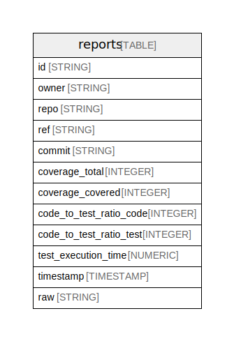

# BigQuery schema for octocov datasource

## Tables

| Name | Columns | Description | Type |
| ---- | ------- | ------- | ---- |
| [reports](reports.md) | 12 | Table to store reports of code metrics sent from octocov. | TABLE |

## Relations

---

> Generated by [tbls](https://github.com/k1LoW/tbls)
