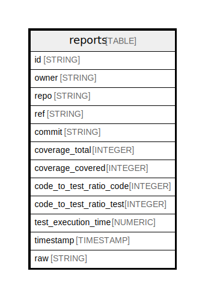

# reports

## Description

## Columns

| Name | Type | Default | Nullable | Children | Parents | Description |
| ---- | ---- | ------- | -------- | -------- | ------- | ------- |
| id | STRING |  | false |  |  |  |
| owner | STRING |  | false |  |  |  |
| repo | STRING |  | false |  |  |  |
| ref | STRING |  | false |  |  |  |
| commit | STRING |  | false |  |  |  |
| coverage_total | INTEGER |  | true |  |  |  |
| coverage_covered | INTEGER |  | true |  |  |  |
| code_to_test_ratio_code | INTEGER |  | true |  |  |  |
| code_to_test_ratio_test | INTEGER |  | true |  |  |  |
| test_execution_time | NUMERIC |  | true |  |  |  |
| timestamp | TIMESTAMP |  | false |  |  |  |
| raw | STRING |  | false |  |  |  |

## Relations

---

> Generated by [tbls](https://github.com/k1LoW/tbls)
